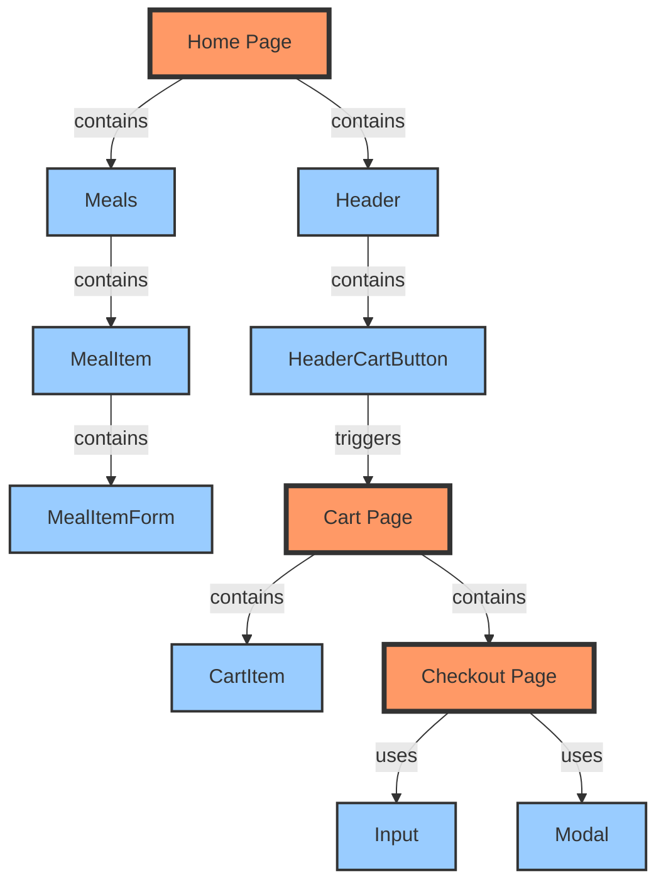
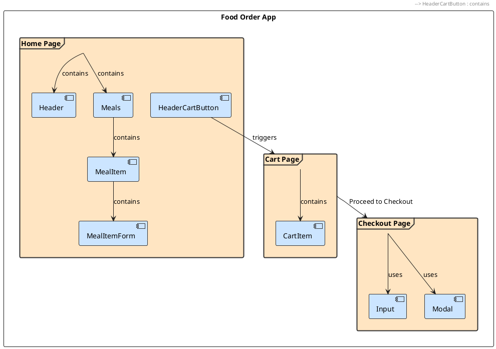

# UI Flow Diagram

This document describes the UI flow of the Food Order App.

## Mermaid Diagram

## PlantUML Diagram

## Standard Practices for UI Flow Documentation

1. **Mermaid/PlantUML**: Text-based diagrams that can be version controlled
2. **Wireframes**: Visual page layouts showing component placement
3. **User Journey Maps**: Show user interactions and touchpoints
4. **Flowchart.js**: Interactive JavaScript-based flowcharts
5. **Graphviz**: Powerful graph visualization for complex flows
6. **Sequence Diagrams**: Show interactions between components over time
7. **Prototyping Tools**: Figma, Adobe XD for interactive mockups
8. **Storybook**: Component documentation with live examples
